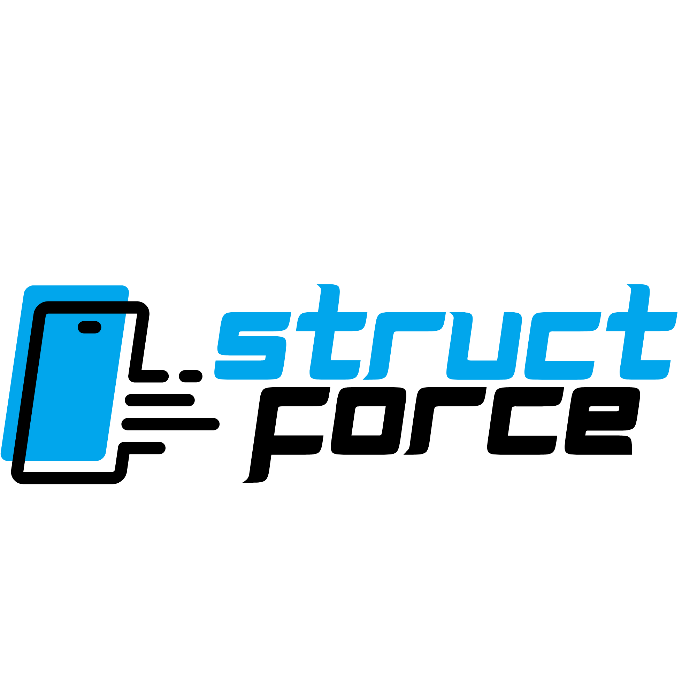
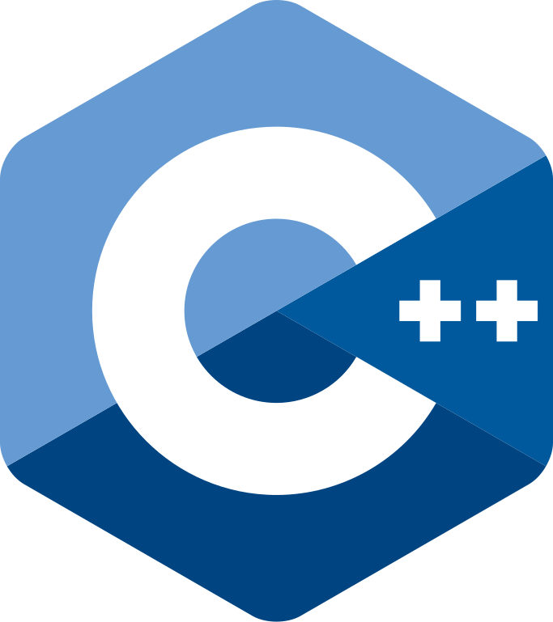

<div align="center">


# ⚡ StructForce ⚡

**Contact Management System**

<br>


<br>

> **C++ contact management application with authentication, sorting, searching, and analytics.**
> Organize your contacts, manage them efficiently, and gain insights with beautiful UI.

<br>

---

</div>

## 🗂️ Table of Contents

1. [What is StructForce?](#-what-is-structforce)
2. [Key Features](#-key-features)
3. [How It Works](#-how-it-works)
4. [Architecture](#️-architecture)
   - Three-Tier Design
   - Benefits
5. [Core Algorithms](#-core-algorithms)
   - QuickSort
   - Linear Search
   - Recursion
6. [Technologies](#-technologies)
7. [Getting Started](#-getting-started)
   - Prerequisites
   - Clone Repository
   - Build
   - Run
8. [Project Structure](#-project-structure)
9. [Team](#-team)
   - Roles & Responsibilities
10. [Documentation](#-documentation)

---

## 🎯 What is StructForce?

**StructForce** is a C++ desktop application for managing personal contacts. It combines a beautiful graphical interface (Dear ImGui), professional three-tier architecture, and powerful algorithms to deliver a complete contact management experience.

Built entirely in **C++11** with **OpenGL 3.3** graphics, StructForce demonstrates:
- ✅ Three-tier architecture (Presentation, Logic, Data layers)
- ✅ Advanced algorithms (QuickSort, Linear Search, Recursion)
- ✅ User authentication with secure password hashing
- ✅ Data persistence in binary files
- ✅ Professional GUI with Dark/Light themes
- ✅ Team collaboration using Scrum and GitHub

---

## ✨ Key Features

| Feature | Details |
|---------|---------|
| 👤 **User Authentication** | Register with validation, secure login with djb2 password hashing |
| 📋 **CRUD Operations** | Add, edit, delete, and organize contacts effortlessly |
| 🔍 **Smart Search** | Case-insensitive substring search by name and phone number |
| ↕️ **QuickSort Algorithm** | O(n log n) sorting by name or phone (ascending/descending) |
| 🏷️ **Contact Grouping** | Organize into categories (Work, Family, Friends, School, General, Other) |
| 📊 **Analytics Dashboard** | View statistics: total contacts, groups, distribution with histograms |
| 🌗 **Theme Support** | Beautiful Dark Mode and Light Mode with one-click switching |
| 💾 **Data Persistence** | Secure binary file storage (users.dat + contacts_<userId>.dat) |
| 🛡️ **Input Validation** | Comprehensive validation — the application never crashes |
| 🎨 **Professional UI** | Dear ImGui-based interface with intuitive card layout |

---

## 🎮 How It Works

```
┌─────────────────────────────────────────────────────┐
│          StructForce Main Interface                 │
│                                                     │
│  ┌──────────┐                   ┌─────────────────┐ │
│  │ SIDEBAR  │  [Contacts View]  │  Contact Grid   │ │
│  │          │                   │                 │ │
│  │ • Contac │  [Search...]      │ [Avatar] Name   │ │
│  │   ts     │  [Name↑][Phone]   │ Phone / Email   │ │
│  │ • Add    │                   │ Group Badge     │ │
│  │   Contac │                   │ [Edit][Delete]  │ │
│  │   t      │                   │                 │ │
│  │ • Analyt │  [Card 2] [Card 3]│ [Avatar] Name   │ │
│  │   ics    │                   │ ...             │ │
│  │          │                   │                 │ │
│  │ [User]   │                   │                 │ │
│  │ [Logout] │                   │                 │ │
│  └──────────┘                   └─────────────────┘ │
└─────────────────────────────────────────────────────┘
```

**User workflow:**

```
1. Register/Login          → Enter credentials, account created/validated
2. Contacts View          → Browse all contacts in beautiful grid
3. Search & Filter        → Find contacts by typing (real-time)
4. Sort                   → Click to sort by name or phone (ASC/DESC)
5. Add Contact            → Form with live preview on the right
6. Edit/Delete            → Select contact, click edit/delete button
7. Analytics              → View statistics and group distribution
8. Theme Toggle           → Switch between Dark/Light mode
9. Logout                 → Save contacts and return to login
```

Every screen is responsive, intuitive, and beautifully designed with ImGui.

---

## 🏗️ Architecture

StructForce uses **Three-Tier Architecture** for clean separation of concerns:

```
┌──────────────────────────────────────────────────┐
│     PRESENTATION LAYER                           │
│  (GUI, ImGui, user interaction)                  │
│  • renderContactsView()                          │
│  • renderAddContact()                            │
│  • renderAuthView()                              │
│  • renderAnalytics()                             │
└────────────────────┬─────────────────────────────┘
                     │
┌────────────────────▼─────────────────────────────┐
│     LOGIC LAYER                                  │
│  (Algorithms, business logic)                    │
│  • quickSort() - O(n log n)                      │
│  • searchContacts() - O(n×m)                     │
│  • countContactsRecursive() - O(n)               │
│  • validateContact()                             │
│  • registerUser() / loginUser()                  │
└────────────────────┬─────────────────────────────┘
                     │
┌────────────────────▼─────────────────────────────┐
│     DATA LAYER                                   │
│  (Structures, persistence)                       │
│  • Contact struct                                │
│  • ContactStore (500 max)                        │
│  • User struct (100 max)                         │
│  • File I/O: users.dat, contacts_*.dat          │
└──────────────────────────────────────────────────┘
```

**Benefits:**
- Clear separation of concerns
- Easy to test and maintain
- Scales well as project grows
- Professional development practice

---

## 🔧 Core Algorithms

### 1️⃣ **QuickSort** — Sorting Algorithm

```cpp
Function: quickSort(store, indices, left, right, field, order)
Time Complexity: O(n log n) average, O(n²) worst
Space Complexity: O(log n) recursion stack
```

**How it works:**
1. Select pivot (middle element)
2. Partition: move smaller elements left, larger right
3. Recursively sort left and right partitions
4. Sort by name or phone, ascending or descending

**Real-world example:**
```
Unsorted: [John 555-1234] [Alice 555-5678] [Bob 555-9999]
Click "Name" → Sorted: [Alice 555-5678] [Bob 555-9999] [John 555-1234]
```

---

### 2️⃣ **Linear Search** — Search Algorithm

```cpp
Function: searchContacts(store, query)
Time Complexity: O(n × m), n=contacts, m=query length
Space Complexity: O(1)
```

**How it works:**
1. Convert query to lowercase
2. For each contact, check if name or phone contains query substring
3. Return all matching contact indices
4. Empty query returns all contacts

**Real-world example:**
```
Search for "alice" →
Finds: [Alice 555-5678] (name match)
       [Bob 555-9999 alice@email.com] (email match)
```

---

### 3️⃣ **Recursion** — Contact Counting

```cpp
Function: countContactsRecursive(store, idx)
Time Complexity: O(n)
Space Complexity: O(n) recursion stack
```

**How it works:**
```
Base case: if idx >= store.count → return 0
Recursive: return 1 + countContactsRecursive(store, idx+1)
```

**Real-world example:**
```
5 contacts stored
countRecursive(0) → 1 + countRecursive(1)
                       → 1 + countRecursive(2)
                           → 1 + countRecursive(3)
                               → ...
                                   → 0 (base case)
Result: 5 ✓
```

---

## 🛠️ Technologies

<div align="center">

### 💻 Language


### 🧰 Tools

&nbsp;&nbsp;


### 🎨 Design

&nbsp;&nbsp;


### 📑 Docs & Presentation

&nbsp;&nbsp;


### 💬 Communication


</div>
---

## 🚀 Getting Started

### Prerequisites

- C++ compiler supporting C++11 (GCC 4.8+, Clang 3.3+, MSVC 2015+)
- CMake 3.10+
- GLFW development files
- OpenGL development files

### Clone Repository

```bash
git clone https://github.com/codingburgas/StructForce.git
cd StructForce
```

### Build

```bash
mkdir build
cd build
cmake ..
cmake --build . --config Release
```

### Run

**Linux/macOS:**
```bash
./StructForce
```

**Windows:**
```bash
StructForce.exe
```

---

## 📂 Project Structure

```
StructForce/
│
├── src/                                  # Source Code
│   ├── main.cpp                          # Entry point, GLFW/OpenGL initialization
│   ├── auth.h / auth.cpp                 # User authentication system
│   ├── data.h / data.cpp                 # Contact data structures
│   ├── logic.h / logic.cpp               # Algorithms (QuickSort, Search, Recursion)
│   ├── presentation.h / presentation.cpp # UI state management
│   ├── ui_helpers.h                      # UI constants and helper functions
│   ├── logo.h / logo.cpp                 # Logo texture loading
│   ├── views_auth.cpp                    # Authentication screens (Login/Signup)
│   ├── views_contacts.cpp                # Contact grid view
│   ├── views_forms.cpp                   # Add/Edit forms and Analytics
│   └── views_sidebar.cpp                 # Sidebar navigation
│
├── docs/                                 # Documentation
│   ├── ARCHITECTURE.md                   # Detailed architecture documentation
│   ├── ALGORITHM_DETAILS.md              # Algorithm specifications
│   └── SPRINT_PLAN.md                    # Development sprints and progress
│
├── README.md                             # This file
├── CMakeLists.txt                        # Build configuration
├── .gitignore                            # Git ignore rules
└── .github/
    └── ISSUE_TEMPLATE/                   # Issue templates for GitHub
```

---

## 👥 Team

<div align="center">

| | Name | Class | Role |
|--|------|-------|------|
|  | [**Teodor Spasov Todorov**](https://github.com/TSTodorov24) | 9A | 🧭 Scrum Trainer |
|  | [**Radostin Veselinov Dimkirichev**](https://github.com/RVDimkirichev24) | 9A | 🔍 Quality Engineer |
|  | [**Alexander Ivaylov Petrov**](https://github.com/AIPetrov24) | 9G | ⚙️ Backend Developer |
|  | [**Alexander Antonov Kasabov**](https://github.com/AAKasabov24) | 9G | ⚙️ Backend Developer |

</div>

### Roles & Responsibilities

**🧭 Scrum Master / Documenter**
- Project coordination and sprint planning
- GitHub repository management
- Documentation and presentation
- Team communication

**⚙️ Backend Developer 1 (Algorithms)**
- QuickSort implementation
- Linear Search implementation
- Recursion implementation
- Algorithm testing and optimization

**⚙️ Backend Developer 2 (Auth & Data)**
- User authentication system
- Password hashing (djb2)
- Contact CRUD operations
- Data persistence and validation

**🔍 Quality Engineer  (UI)**
- ImGui and OpenGL integration
- GUI design and implementation
- Theme support (Dark/Light mode)
- User experience and responsiveness


---

## 📚 Documentation

| 📋 Documentation | 🎤 Presentation |
|-----------------|----------------|
| [View Documentation](https://codingburgas-my.sharepoint.com/:w:/g/personal/tstodorov24_codingburgas_bg/IQCRG579ND7XRKWWJG9SMxlrASmWaQCtO5HEALOhbMqyLi0?e=wvlB5N) | [View Presentation](https://codingburgas-my.sharepoint.com/:p:/g/personal/tstodorov24_codingburgas_bg/IQAnv6HcouueToRQoJm1mcGxAXErGN0blcgi5nteveYk6eU?e=eojzVN) |

---


<div align="center">

Made with ❤️ by **Team StructForce**

</div>
